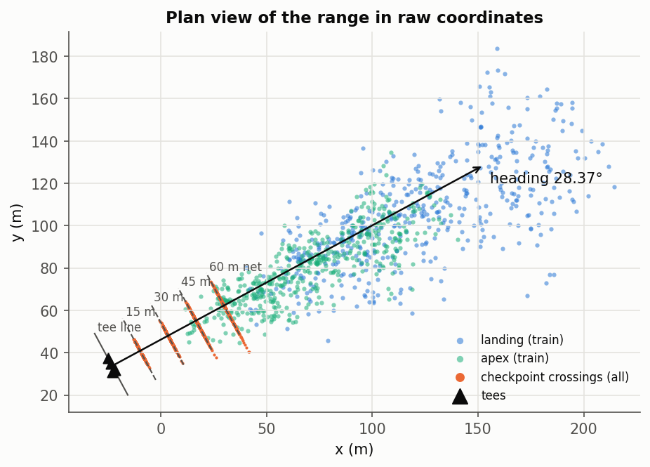
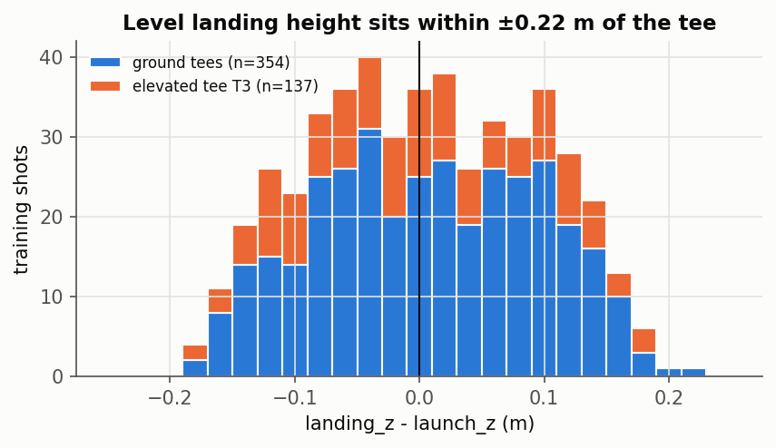
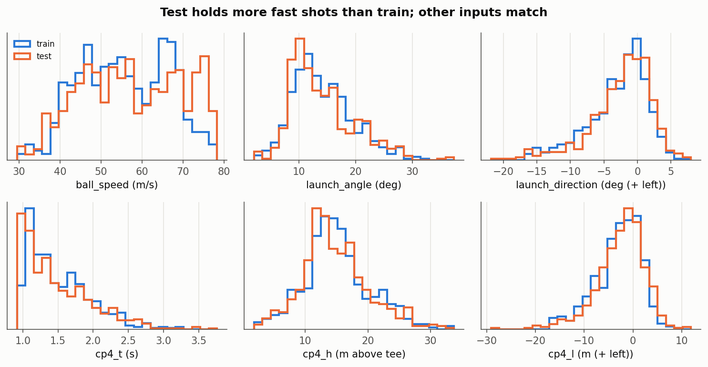
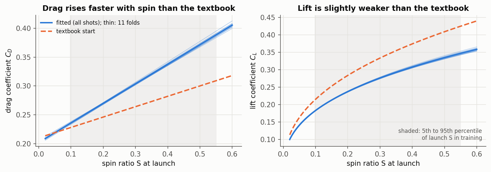
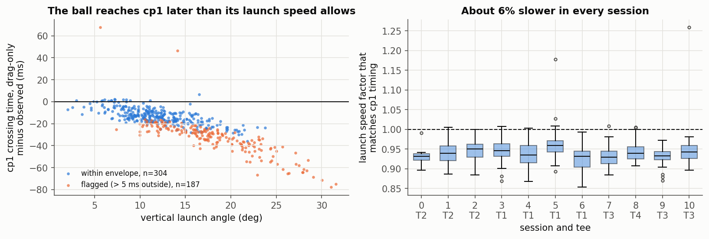
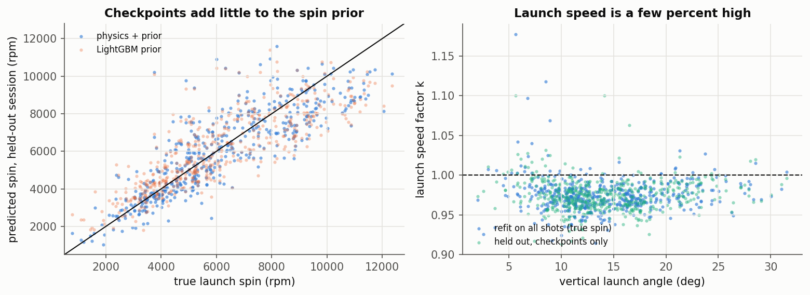
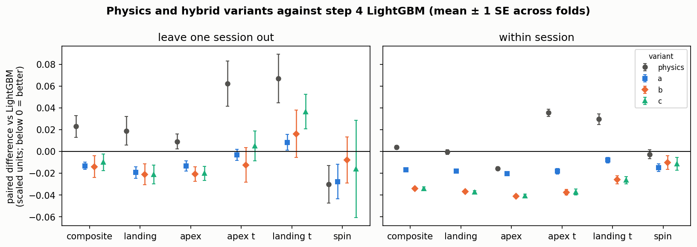
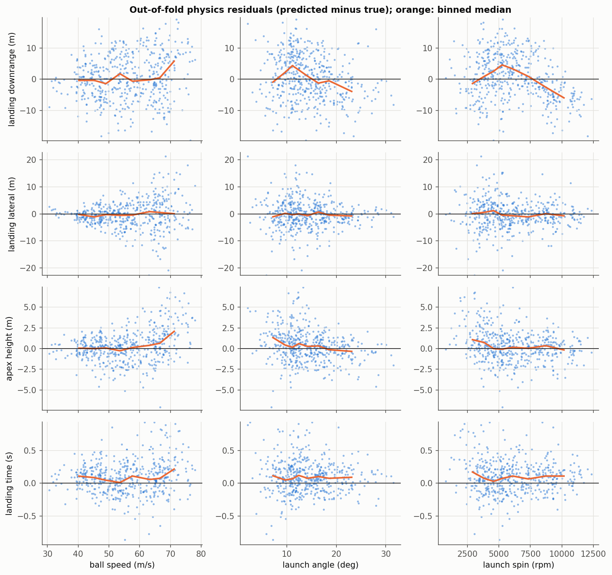
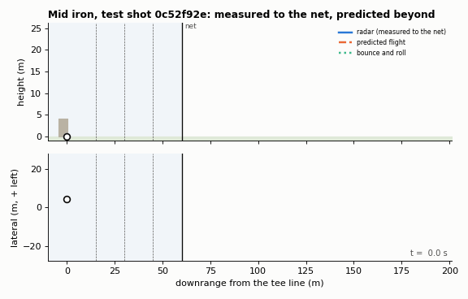
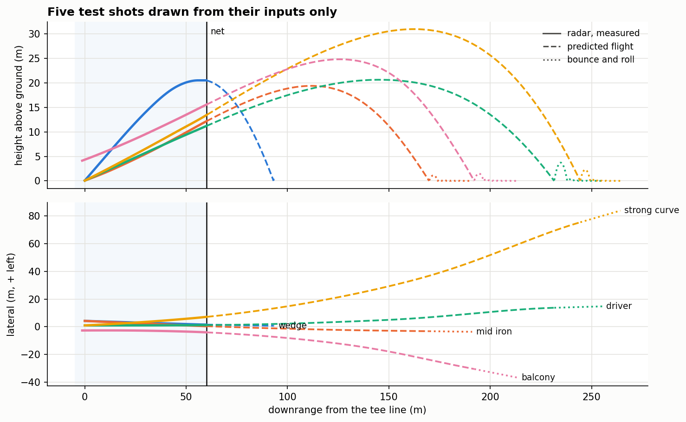

# Predicting a golf ball's full flight from its first 60 metres

Gabriella Scott. Code, figures and cross-validation numbers: https://github.com/Gabriella-Scott/inrange-comp

## 1. The problem and the data

On a compact urban driving range a net stops the ball after about 60 m, so a radar sees only the opening portion of every shot. The task is to recover the rest: the launch spin rate, the apex position and time, and the level landing position and time, from the launch conditions and four checkpoint crossings at 15, 30, 45 and 60 m.

The data is 491 training shots and 559 test shots recorded near Stellenbosch, where a full-flight radar and an in-bay launch monitor saw the same shots, so the truth is known for the training half. Each row gives a launch position and velocity, and an interpolated crossing time and position at each checkpoint. Nothing else about the flight is available.

Submissions are scored by a hidden weighted composite in which landing position counts most, then apex position, then the two times, then spin. Because the weights are held back, I approximated that metric in `src/inrange/scoring.py`: each component is divided by the error of predicting the training mean, then combined with weights 0.40 / 0.25 / 0.125 / 0.125 / 0.10 in the stated order, so 1.0 means "no better than the training mean". Every result below also reports its components, and section 4 shows the conclusions do not depend on the weights I chose.

## 2. What the data showed

**The range points along one fixed heading, and the checkpoints are fixed lines.** Averaging the bearing from tee to checkpoint gives about 25.8°, but that is biased by shots that curve. Choosing instead the angle that makes every checkpoint crossing lie on a straight line collapses the spread to numerical precision at **28.3666°** from the x axis. The checkpoints are not measured from each tee: they are fixed lines 15, 30, 45 and 60 m beyond one common tee line. All modelling then happens in a tee-centred frame of downrange, lateral and height.

**Four tees, one on a balcony.** Three tees are at ground level, within 0.36 m of the tee line; tee T3 is 4.125 m up and 1.26 m behind it, so its checkpoints are effectively 16.3 to 61.3 m away, and its shots keep falling after level landing.

**Level landing is launch height.** The difference `landing_z - launch_z` has mean 0.005 m and standard deviation 0.090 m, and never exceeds 0.22 m, so `landing_z` is predicted as `launch_z` with no model at all.

**The radar samples at 50 Hz.** Every `apex_t` falls on an even hundredth of a second and every `landing_t` on an odd one: apex is reported at a sample, landing at the midpoint of the two samples bracketing the crossing. The implied offset spreads almost evenly over ±10 ms (standard deviation 5.80 ms, against 5.77 ms for a uniform distribution), which explains the height noise above and sets a floor of about 10 ms on landing time.

**Sessions, and a faster test set.** Gaps between shots are at most 41 minutes within a day and at least 21.7 hours between days, giving 11 practice sessions, one per calendar day, each on a single tee. Every session is split between train and test, 38% to 62% held out, so the real split is random within sessions rather than by session. It is not even in one respect: shots of 70 m/s and above are 19.5% of the test set but 7.5% of training (109 against 37 shots, p = 0.001). Those are the hardest shots, so results below are also reweighted to the test set's speed mix.

## 3. Approach

With 491 training rows, a model cannot learn projectile motion, drag and the Magnus effect from scratch, and a tree ensemble cannot extrapolate past the shots it has seen. Physics supplies both. The first 60 m also encodes spin implicitly, because backspin flattens the early rise, so a simulator can be inverted for the spin the radar never measures. The final model is a hybrid: physics recovers each shot's state, and gradient boosting corrects what the physics gets wrong.

**The simulator.** A ball flies under gravity, drag and Magnus lift, with coefficients depending on the spin ratio S and spin decaying exponentially. Fitting needs thousands of simulations, so `src/inrange/physics.py` integrates every shot at once with a fixed-step RK4 at 0.02 s, locating apex, landing and checkpoint crossings by cubic Hermite interpolation inside a step rather than snapping to the grid. Against a `solve_ivp` reference at tolerance 1e-11 it agrees to better than 0.001 mm and 0.001 ms. Spin decay time is not identifiable from flights of a few seconds, since refitting everything else changes the cost by under 1% between 10 s and 200 s, so it is fixed at 25 s.

**Fitted coefficients.** Drag and lift were fitted to all 491 training shots with one spin-axis tilt per shot, using `least_squares` with a robust loss and a sparse Jacobian, giving C_D = 0.184 + 0.328 S and C_L = 0.441 S^0.391, stable across folds (standard deviation at most 0.008). Drag rises with spin nearly twice as fast as the textbook 0.21 + 0.18 S.

**The launch speed reads high.** This is the most useful finding here for Inrange. With drag-only physics from the given launch state, the ball reaches the first checkpoint a median 5.95% of the elapsed time early and the second 6.34% early. For 187 of 491 shots no plausible drag bridges that gap: their timing lies more than 5 ms outside an envelope spanning drag coefficients 0.1 to 0.5, lift 0 to 0.4 and tilts of ±45°. No shot's lateral or height position falls outside it, so this is a speed problem, not a direction problem.

Refitting the aerodynamics with a per-shot factor on the launch velocity puts that factor at a median of **0.973**, with 92.5% of shots below 1. In other words the radar's launch speed reads about 2.7% high against its own checkpoint timings once drag is fitted properly. The factor no longer depends on launch angle (correlation −0.004) or spin (0.031), which is why the larger 6% figure from textbook coefficients was partly a drag error. A 1% speed error moves a simulated carry beyond 180 m by about 2.6 m, so this bias is worth chasing in the radar's own pipeline.

**The inverse solve, and what it cannot do.** With the coefficients fixed, each shot's spin, tilt and speed factor are fitted to its 12 checkpoint residuals alone, so the same solve works on test shots. Spin and speed trade off, since raising both slows the ball the same way: from the checkpoints alone the fitted spin misses by 1361 rpm on average, and the two correlate 0.53 within a typical shot. A weak prior handles this honestly, pulling spin towards LightGBM's own prediction with a strength set by how wrong that prediction usually is (about 1081 rpm) rather than tuned. Out of fold the result is 983 rpm against 1051 for the prior alone with a session held out, and 871 against 876 within sessions: the checkpoints add a little spin information, and only when the session is new.

**Physics alone is not enough.** Given the *true* spin, the simulator still lost to the gradient boosting baseline: composite without the spin term 0.167 against 0.133 with sessions held out, a paired difference of +0.040 (standard error 0.011) that went the wrong way in 10 of 11 sessions. One global coefficient set cannot absorb per-shot launch errors, while the baseline leans on checkpoint-derived speeds that carry no such bias.

**The hybrid.** The fitted states and simulated flight therefore feed LightGBM, both as extra features and as a baseline whose residual the model predicts, choosing per component the variant with a paired improvement beyond one standard error. The submitted model predicts the residual to physics for landing, apex and both times, and uses physics features for spin. One physical constraint is applied afterwards: predicted apex height is raised to at least the highest measured checkpoint height, because a real apex can never sit below a point the radar saw the ball pass.

## 4. Results

Every model is cross-validated two ways: leaving out one whole session at a time (11 folds), and repeated random holdouts within each session matching the real test split (10 repeats). The second mirrors the competition split, the first is the harder test of a new player on a new day.

Composites first (lower is better), then the unscaled position errors as leave-one-session-out / within-session.

| Model | Leave-one-session-out | Within-session | Landing (m) | Apex (m) |
| --- | --- | --- | --- | --- |
| Training mean | 1.016 | 1.017 | 42.5 / 42.8 | 31.9 / 31.9 |
| LightGBM only | 0.185 | 0.187 | 6.02 / 6.51 | 3.44 / 3.95 |
| Physics from inputs only | 0.198 | 0.191 | 6.46 / 6.49 | 3.48 / 3.45 |
| **Hybrid (submitted)** | **0.165** | **0.152** | 4.99 / 4.95 | 2.63 / 2.64 |

Reweighted to the test speed mix the submitted model scores 0.172 and 0.160, with a landing error of 5.0 m against 6.0 m for gradient boosting alone.

Comparisons are made fold by fold, because fold-to-fold spread mostly reflects how hard each held-out session is and both models share that. Paired against the baseline, the hybrid is better by **0.016 (standard error 0.009)** with sessions held out, winning in 10 of 11, and by **0.035 (0.001)** within sessions, winning in all 10 repeats. For two near-identical models the paired standard error is 0.002 and 0.0003, so differences below about 0.005 are noise and I claim none. By speed band the within-session gains are 0.042, 0.029 and 0.048 for slow, mid and fast shots; with sessions held out the slow and mid bands gain 0.023 and 0.016, but the fast band does not (+0.013, standard error 0.040, on 37 shots and 8 usable folds).

Because the real weights are hidden, the saved out-of-fold predictions were rescored under 1000 random weight vectors respecting the stated ordering, and again under a scaling that divides each component by the spread of that target instead. The hybrid beat the baseline in all 4000 rescorings, by a median 0.016 and 0.036 under the two strategies, so the ranking does not depend on my weight guess.

Residual diagnostics show where the remaining error sits: it grows with ball speed, and landing time runs late rather than early.

## 5. The animation

Interactive versions of five test shots, plus one training shot with its truth toggled on, are published at https://gabriella-scott.github.io/inrange-comp/ and regenerated by `python animate_shot.py --track-id <id>`.

A trajectory is built from the 24 input columns alone. The model solves the shot's spin, tilt and speed factor from its checkpoints and predicts apex and landing. The physics path for those states is then bent twice so it agrees with everything known: a piecewise-linear time warp maps the simulated checkpoint, apex and landing times onto the observed and predicted ones, and a smooth offset curve per coordinate carries the path through the measured checkpoints and the submitted apex and landing. The result meets all six anchor points to within 1e-14 (metres, and milliseconds in time), peaks at the submitted apex, and stays above ground until it lands.

Corrections are small near the radar and grow where nothing was measured: medians of 0.01 to 0.05 m laterally and 0.22 to 0.51 m in height at the checkpoints, 1.18 m at the apex and 2.93 m at landing. Three cases need care: 92 shots reach their apex before the net, 16 need the apex anchor moved to keep the time mapping increasing, and 105 have their height capped at the submitted apex by a median 0.02 m. All 1050 shots are drawn in 21.6 s.

## 6. Bounce and roll

The competition data contains no bounce or roll information, so this part is taken from the literature and is illustrative rather than fitted. After the ball reaches the ground the model follows Penner (2002b): the coefficient of restitution falls with impact speed as e = 0.510 − 0.0375 v + 0.000903 v² up to 20 m/s (p. 933), each impact is resolved in a frame rotated by a turf-compliance angle that grows with impact speed and angle (p. 934), the ball rolls out of the impact when friction exceeds a critical value, keeping five sevenths of its tangential speed less a backspin term (p. 933, after Daish), bouncing stops below a 5 mm rebound (p. 935), and rolling decelerates at five sevenths of ρ_g g with ρ_g = 0.131 (p. 935). That rolling value is for a putting green, and Penner notes a fairway should be higher (2002b, p. 935); greens span 0.065 to 0.196 (Penner, 2002a, p. 85).

For three test shots the model gives a wedge carrying 93.1 m with 0.3 m of run, a mid iron carrying 169.9 m with 21.3 m, and a driver carrying 231.7 m with 23.7 m. The implementation reproduces Penner's own worked first-bounce heights for two drives (1.18 m against his 1.17 m, and 2.82 m against 2.82 m; 2002b, p. 936).

The dominant uncertainty is the turf-compliance angle, which Penner fitted to a single measured impact: halving it adds 5.7 m to the wedge, 43.2 m to the mid iron and 118.7 m to the driver, while restitution, rolling friction and the stopping height each move totals by about a metre. Measurements on more turf types exist (Biber et al., 2023), but without range-specific data the run is an illustration.

## 7. Limitations and next steps

Fast shots remain the weak point: at 70 m/s and above the hybrid gains nothing when the session is unseen, and only 37 training shots sit in that band. Six of the 11 sessions show a mean downrange bias more than three standard errors from zero, from −5.7 m to +8.5 m, consistent with wind but confounded with player and clubs on a one-session-per-day design, so per-session wind is the obvious next model. The variant per component was selected on the same cross-validation that reports the gains, so the quoted improvement is slightly optimistic, though the within-session margin is far above the noise floor. The apex floor is a physical constraint rather than a tuned choice and only moved impossible predictions; a fuller version would also keep the predicted apex time consistent with a ball still climbing at the net.

## 8. Reproducibility

Everything is rebuilt from the raw CSVs. A clean clone with a fresh environment and no caches passed all 32 tests, and `make_submission.py` reproduced the submitted predictions exactly, with a maximum absolute difference of 0.0 in every column. The four notebooks then ran in 8.0 s, 26 min 42 s, 3 min 35 s and 1 min 7 s, rebuilding every cache, figure and animation. One trap is worth repeating: `nbconvert` runs a kernel that launches whichever `python` is first on PATH, and `python -m jupyter nbconvert` dispatches to the `jupyter-nbconvert` on PATH, so a notebook can silently run in a different environment. The README pins both.

This entry was written with Claude Code under my direction. I set the plan, the conventions and the stopping rules, reviewed every step, and required each number quoted here to come from a computed artefact in the repository.

## References

Biber, S. W., Jones, K. M., Champneys, A. R., Green, R., & Szalai, R. (2023). *Measurements and linearized models for golf ball bounce* (arXiv:2302.02758). arXiv. https://arxiv.org/abs/2302.02758

Penner, A. R. (2002a). The physics of putting. *Canadian Journal of Physics, 80*, 83–96. https://doi.org/10.1139/p01-137

Penner, A. R. (2002b). The run of a golf ball. *Canadian Journal of Physics, 80*(8), 931–940. https://doi.org/10.1139/p02-035
